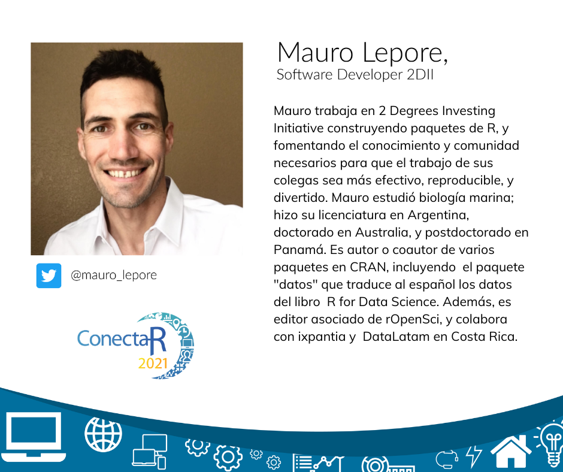
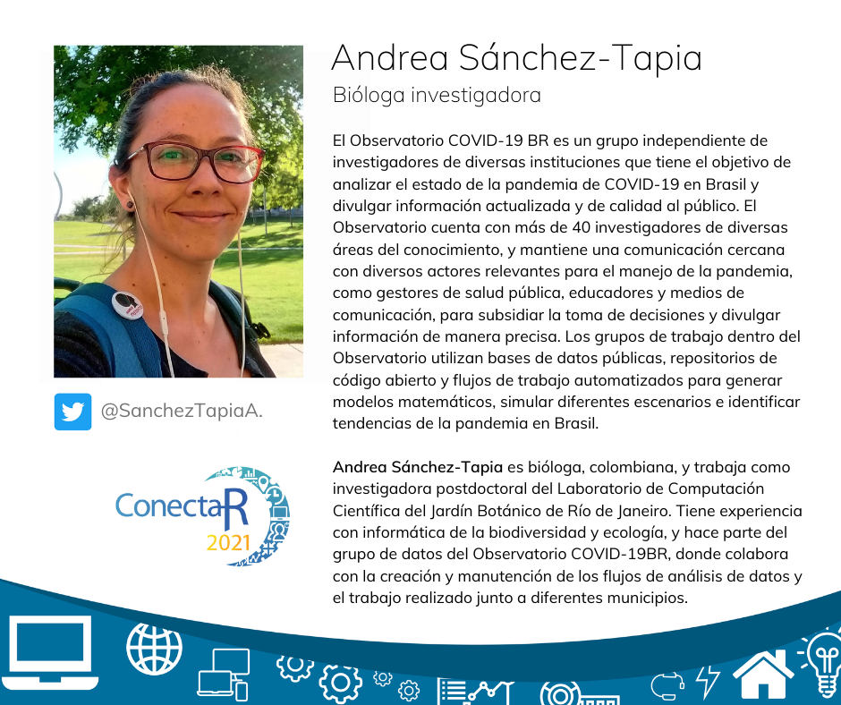
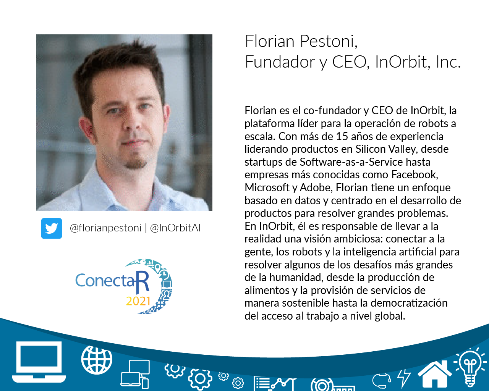

## Keynotes

### Ciencia de datos geoespaciales para la vigilancia de la salud pública - Paula Moraga

Los datos de salud geoespaciales son esenciales para informar las políticas de salud pública. Estos datos pueden utilizarse para cuantificar la carga de enfermedades, comprender patrones geográficos y temporales, identificar factores de riesgo y medir desigualdades. En esta charla, describiré mi investigación que se centra en el desarrollo de métodos geoespaciales y aplicaciones de visualización interactivas para la vigilancia de la salud. Mostraré varios paquetes de R para manipular, modelizar y visualizar datos espaciales y para predecir el riesgo y guiar la implementación de intervenciones para la eliminación de enfermedades tropicales en varios países. También mostraré los paquetes de R epiflows para la predicción de la propagación de enfermedades por flujos de viajes, y SpatialEpiApp para el mapeo de enfermedades y la detección de clusters. Finalmente, describiré mis futuras líneas de investigación y cómo estas pueden contribuir a mejorar la salud de la población a nivel global.

### Cadena de favoRes - Mauro Lepore

El éxito de R depende de su comunidad. Históricamente, la popularidad de R (en Latinoamérica y el mundo) cambió mucho, y en relación a aspectos comunitarios. En esta charla, voy a argumentar que el crecimiento de R es alimentado por una cadena de favores; cada eslabón de la cadena representa el rol de un miembro de la comunidad de R. Voy a contar cómo encontré mi eslabón y, si aún no está claro, espero ayudarte a encontrar el tuyo.

### Observatorio COVID19-BR - Andrea Sánchez-Tapia

El Observatorio COVID-19 BR es un grupo independiente de investigadores de diversas instituciones que tiene el objetivo de analizar el estado de la pandemia de COVID-19 en Brasil y divulgar información actualizada y de calidad al público. El Observatorio cuenta con más de 40 investigadores de diversas áreas del conocimiento, y mantiene una comunicación cercana con diversos actores relevantes para el manejo de la pandemia, como gestores de salud pública, educadores y medios de comunicación, para subsidiar la toma de decisiones y divulgar información de manera precisa. Los grupos de trabajo dentro del Observatorio utilizan bases de datos públicas, repositorios de código abierto y flujos de trabajo automatizados para generar modelos matemáticos, simular diferentes escenarios e identificar tendencias de la pandemia en Brasil. La página del Observatorio es https://covid19br.github.io/ y la cuenta de twitter es https://twitter.com/obscovid19br. 

### EmprendeR: notas sobre el uso de R en la dirección de una empresa de robótica - Florian Pestoni

Crear y dirigir un startup de tecnología es un desafío; más aún es hacerlo en una área emergente como la de los robots autónomos. Como fundador y CEO de InOrbit, una plataforma para operación de robots a escala, mi objetivo es utilizar datos para tomar mejores decisiones. Con un equipo pequeño, donde todos ponemos nuestro mejor esfuerzo para avanzar el producto y el negocio, es importante para mí poder ser autosuficiente y no depender de que algún ingeniero o científico de datos pueda tomarse el tiempo para contestar una pregunta. Se espera que alguien como yo con un MBA pueda utilizar Excel, y sin duda lo he usado intensamente para crear modelos financieros complejos. Pero a la hora de sumergirme más profundo en los datos operativos, la limitaciones de Excel se hicieron sentir. Así es que decidí aprender R y crear dashboards, reportes y notebooks. En esta charla, quiero compartir mi experiencia en el trayecto hacia el uso de R en la dirección de una empresa de robótica.

## Charlas

### Día 1, Sesión 1

* SNPverso y demencia - Erick Cuevas Fernández
* R para conocer sobre biodiversidad desde GBIF - Angélica Arenas Rodríguez

### Día 1, Sesión 2

* rTLS: una herramienta en R para procesar y calcular métricas de nubes de puntos derivadas de sensores LiDAR terrestres - J. Antonio Guzmán Q
* EnRedándonos con datos atípicos en análisis ecológicos - Angie Viviana Montañez Salinas

### Día 2, Sesión 1

* Ya sabe programar en R, ¿y enseñarlo? - Cristina Soto Rojas; Mariana Cubero Corella; Carlos Gamboa-Venegas
* Incorporando R como herramienta de análisis de datos en el curso de Estadística para estudiantes de Computación - Esteban Jose Ballestero Alfaro

### Día 2, Sesión 2

* Análisis de Sentimientos con Rstudio - Estephani Jusep Rivera Jaramillo
* Lo que no enseñan en cursos de ciencia de datos: Una interpretación práctica de DataOps - Ronny Alexander Hernández Mora

### Día 3, Sesión 1

* Geovisor del Sistema Nacional de Información Ambiental - Allan Martínez M.
* Uso de R para fiscalización de compras públicas - Juan Alejandro Herrera López

### Día 3, Sesión 2

* Ciencia de datos aplicada a la gestión de control de las contribuciones sociales en la lucha contra la pobreza en Costa Rica - Roberto Delgado Castro	
* Dittodb: un entorno de prueba para consultas a bases de datos - Mauricio Vargas	

### Día 4, Sesión 1

* R y Google para digital marketing - Gloria Edith Rodriguez Ramirez	
* Gestión de consumo eléctrico en plantas de generación mediante R - David Barquero Álvarez	

### Día 4, Sesión 2

* R en procesos Lean Six Sigma para industrias de manufactura latinoamericanas - Jhair Aldás	
* Identificación de nombres de empresas en artículos de noticias: Aplicación de la técnica NER en lenguaje natural - Gustavo Céspedes Ramírez	

## Pósters

<table class="table table-bordered table-hover table-condensed">
<thead><tr><th width="40%" title="Field #1">Nombre</th>
<th width="40%" title="Field #2">Título</th>
<th width="10%" title="Field #3">Sala</th>
</tr></thead>
<tbody><tr>
<td>Philippe Heymans Smith </td>
<td><a href="https://pheymanss.github.io/chronicle_conectaR2021/">chronicle: Reportería HTML sin fricción</a></td>
<td align="right">1</td>
</tr>
<tr>
<td>Eugenio Grant Mora</td>
<td><a href="https://rpubs.com/EugenioGrant/ConectaR2021">Democratizando el uso de modelos de Machine Learning con Shiny</a></td>
<td align="right">2</td>
</tr>
<tr>
<td>Marta Cousido Rocha</td>
<td><a href="marta_cousido.pdf">A new R package for the analysis of the fisheries population under uncertainty</a></td>
<td align="right">3</td>
</tr>
<tr>
<td>Luis Barboza-Barquero</td>
<td><a href="http://rpubs.com/LBarboza/717296">Análisis y visualización de datos del fenotipo de las semillas y germinación de un set de accesiones de la colección mundial de frijol mediante Rstudio</a></td>
<td align="right">4</td>
</tr>
<tr>
<td>Agustin Nieto </td>
<td><a href="https://estudiosmaritimossociales.org/hd_con_r.html">Humanidades digitales con R</a></td>
<td align="right">5</td>
</tr>
<tr>
<td>Maikol Solís Chacón  </td>
<td><a href="https://github.com/maikol-solis/poster-maikol-solis-conectaR-2021/blob/master/uso_y_experiencias_de_r_exams_para_mediacion_virtual_en_la_ucr.pdf">Uso y experiencias de R-exams para Mediación Virtual en la UCR</a></td>
<td align="right">6</td>
</tr>
<tr>
<td>Eduardo Jimenez Gonzalez</td>
<td><a href="url">Ciudades Inteligentes</a></td>
<td align="right">7</td>
</tr>
<tr>
<td>Gustavo Céspedes Ramírez</td>
<td><a href="https://gustavocesra.shinyapps.io/jugadores_similares/">Búsqueda de jugadores con características de rendimiento similares en el fútbol centroamericano</a></td>
<td align="right">8</td>
</tr>
<tr>
<td>Jorge Mario Carrasco Ortiz</td>
<td><a href="https://sop.defensajuridica.gov.co/reportes/conectaR/#0">Generación de reportes automáticos Mongo DB+Streamlit+R</a></td>
<td align="right">9</td>
</tr>
<tr>
<td>Miguel Francisco Benavides Acevedo</td>
<td><a href="Poster_mapas_de_ligamiento_papaya_ConectaR.pdf">Uso de R para elaborar y visualizar mapas de ligamiento genético, y mapeo de genes causales de una mutación en papaya</a></td>
<td align="right">10</td>
</tr>
 <tr>
<td>Valery Zúñiga Kondrashov</td>
<td><a href="https://telaroz.github.io/conectaR2021/index.html">Estadísticas de grupo rápidas: Cómo sacar el máximo provecho del paquete data.table</a></td>
<td align="right">11</td>
</tr>
   <tr>
<td>Leonardo Collado Torres</td>
<td><a href="https://speakerdeck.com/lcolladotor/biocthis-conectar2021">biocthis: crea paquetes de R/Bioconductor</a></td>
<td align="right">12</td>
</tr>
</tbody></table>

